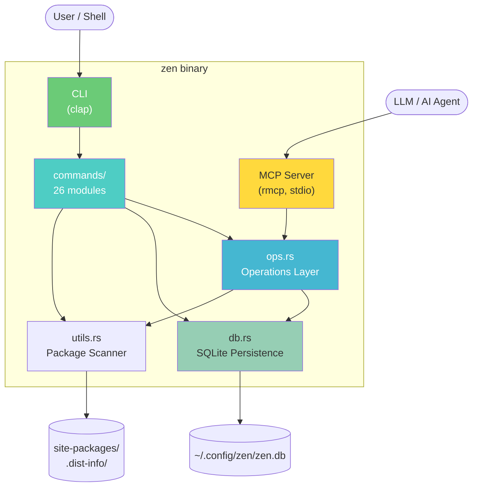
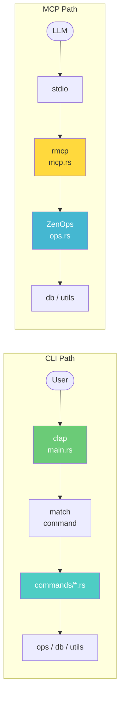
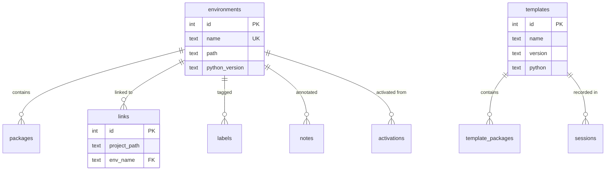

# Zen Architecture

> Single-binary Python environment manager with integrated MCP server.

## Overview

Zen is a Rust CLI tool that manages Python virtual environments with first-class support for the [Model Context Protocol](https://modelcontextprotocol.io/) (MCP). It ships as a single binary (~5 MB) with an embedded SQLite database for persistence.



## Module Layout

```
src/
├── main.rs             # CLI definitions (clap) + dispatcher
├── lib.rs              # Public re-exports for library consumers
├── ops.rs              # Operations layer — business logic entry point
├── db.rs               # SQLite persistence (environments, templates, links)
├── mcp.rs              # MCP server (rmcp) — 11 tools over stdio
├── commands/            # CLI command implementations (26 modules)
│   ├── mod.rs
│   ├── activate.rs      # Smart project-aware activation
│   ├── create.rs        # Environment creation + template application
│   ├── template.rs      # Template CRUD + REPL session
│   ├── list.rs          # Adaptive-width environment listing
│   ├── install.rs       # Package installation with index support
│   ├── link.rs          # Project-environment associations
│   ├── inspect.rs       # Package metadata inspection
│   ├── add.rs           # Register existing environments
│   ├── info.rs          # Environment details
│   ├── rm.rs            # Environment removal
│   ├── clone.rs         # Environment cloning
│   ├── health.rs        # Dependency + CUDA health checks
│   ├── find.rs          # Cross-environment package search
│   ├── diff.rs          # Environment comparison
│   ├── setup.rs         # Interactive setup wizards
│   ├── note.rs          # Environment annotations
│   ├── label.rs         # Environment tagging
│   ├── status.rs        # System dashboard
│   ├── config.rs        # Configuration management
│   ├── export.rs        # Registry export (JSON)
│   ├── import.rs        # Registry import (JSON)
│   ├── reset.rs         # Factory reset
│   ├── rename.rs        # Environment renaming
│   ├── uninstall.rs     # Package removal
│   ├── run.rs           # Run commands inside environments
│   └── log.rs           # Activity log viewer
├── repl.rs              # Template REPL engine (add/drop/save/quit)
├── utils.rs             # Package scanning, version comparison, helpers
├── types.rs             # EnvName newtype, Diagnostic trait, health types
├── validation.rs        # Input sanitization (names, Python/CUDA versions)
├── error.rs             # ZenError enum with MCP retriability
├── context.rs           # OutputMode (Cli/Plain) for color control
├── hooks.rs             # Shell hook generation (bash/zsh/fish)
├── activity_log.rs      # Append-only audit trail
└── table.rs             # Table formatting helpers
```

## Codebase Stats

| Module | Lines | % | Role |
|--------|------:|--:|------|
| `db.rs` | 1,393 | 13% | SQLite persistence (52 public methods) |
| `mcp.rs` | 1,097 | 10% | MCP server (23 tools) |
| `main.rs` | 1,096 | 10% | CLI definitions + thin dispatcher |
| `utils.rs` | 1,002 | 9% | Package scanning, health, version comparison |
| `commands/` | 3,920 | 35% | 26 command modules |
| `ops.rs` | 827 | 7% | Operations layer (22 public methods) |
| `repl.rs` | 816 | 7% | Template REPL engine |
| Other | 991 | 9% | types, validation, error, hooks, context, etc. |
| **Total** | **~11,142** | | |

## Data Flow



### CLI Path

`main.rs` parses arguments via clap and dispatches to the corresponding command module. Each module receives only the dependencies it needs (`&Database`, `&ZenOps`, etc.).

### MCP Path

The MCP server routes all calls through `ZenOps`, which owns output mode control (`OutputMode::Plain` — no ANSI colors).

### Key Difference

CLI commands may bypass `ops.rs` and call `db` or `utils` directly for operations not yet migrated to the ops layer. MCP always goes through `ops.rs`.

## Key Abstractions

### `EnvName` (newtype)

Validated environment name that rejects empty strings, path traversals (`../`), shell metacharacters, and hidden files. Used in clap argument parsing via `FromStr`.

### `ZenOps`

Business logic entry point. Holds `&Database`, `home` path, and `OutputMode`. Provides 22 high-level methods (`create_env`, `remove_env`, `install_packages`, `check_health`, etc.).

### `Database`

SQLite wrapper with 52 methods covering environments, templates, packages, links, sessions, labels, notes, and configuration. DB file is created with `0o600` permissions. Schema is auto-migrated on open.

### `OutputMode`

Enum (`Cli` | `Plain`) that controls colored output. CLI uses `Cli` (ANSI colors), MCP uses `Plain` (no colors). Wired through `ZenOps` so ops-layer output respects the caller's context.

### `ZenError`

`thiserror`-based error enum with variants for validation, not-found, system, and database errors. Each variant carries `retriable: bool` metadata for MCP consumers.

## Persistence

SQLite database at `~/.config/zen/zen.db` (configurable via `--db-path`).



| Table | Purpose |
|-------|---------|
| `environments` | Name, path, Python version, created/updated timestamps |
| `packages` | Per-environment package inventory (name, version, installer, source) |
| `templates` | Named package recipes with ordered installation steps |
| `template_packages` | Packages within templates, with step ordering and install args |
| `links` | Project directory ↔ environment associations |
| `activations` | Activation history for smart environment selection |
| `sessions` | Active template recording sessions |
| `labels` | Environment tags (e.g., `ml`, `dev`, `favorite`) |
| `notes` | Free-text annotations on environments |
| `config` | Key-value configuration (e.g., `stack_info` tracked packages) |

## Key Dependencies

| Crate | Purpose |
|-------|---------|
| `clap` | CLI argument parsing with derive macros |
| `rmcp` | MCP server implementation (stdio transport) |
| `rusqlite` | SQLite with bundled engine (no system dependency) |
| `reqwest` | HTTP client (for install script downloads) |
| `tokio` | Async runtime (required by rmcp) |
| `comfy-table` | Terminal table rendering |
| `rustyline` | Template REPL with history and line editing |
| `colored` | ANSI color output |
| `serde` / `serde_json` / `toml` | Serialization (config, export/import, templates) |

## Testing

- **68 unit tests** across `types`, `validation`, `repl`, `context`, `error`, `db`
- **12 CLI integration tests** (`tests/cli_test.rs`) — spawn the binary, verify output
- **14 database integration tests** (`tests/integration_test.rs`) — tempdir-based DB tests
- All tests run in < 3 seconds

## Security Model

- Database file: `0o600` (owner read/write only)
- Input validation: `validate_name` rejects path traversals and shell metacharacters
- SQL: all queries use parameterized bindings (no `format!` with SQL)
- Commands: all `Command::new` calls use `.arg()` (no shell string interpolation)
- MCP: stdio transport only (no TCP/UDP listeners)
- No credentials or secrets in source code
