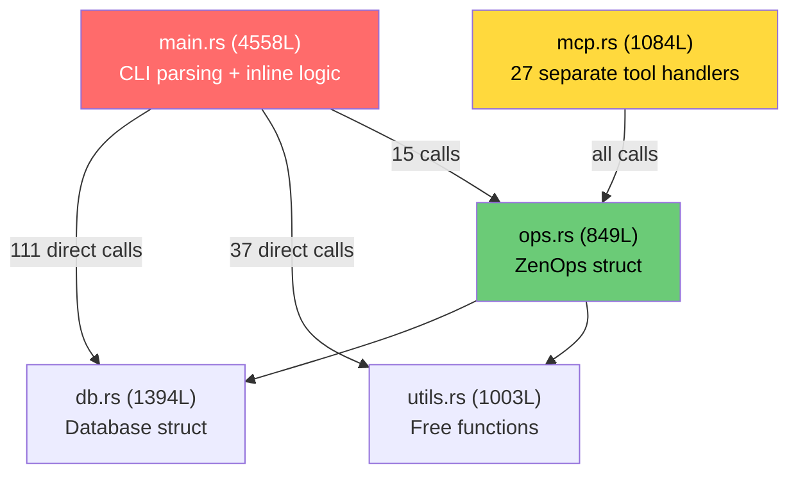
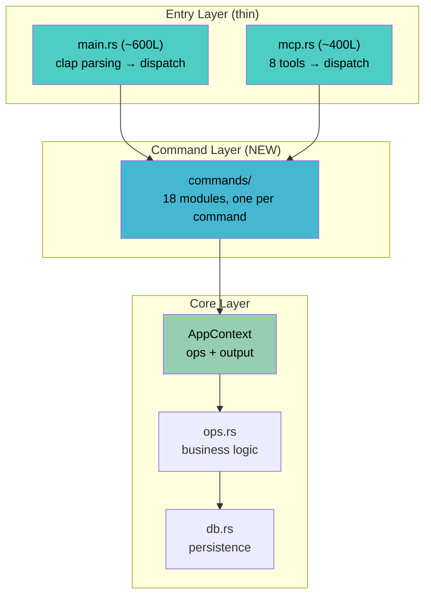

# Zen v0.7.0 — Architecture Migration Plan

> The Sandwich refactor: simpler CLI, consolidated MCP, shared command layer, full test safety.
>
> **This document is the single source of truth for the v0.7.0 migration.**
> It is designed to be picked up cold by an agent or developer with no prior context beyond the codebase itself.

---

## 1. Problem Statement

`main.rs` is 4,558 lines (43% of the 10,630-line codebase). It contains all CLI command logic inline in a single `match cli.command { ... }` block. This means:

- **Every feature must be implemented twice**: once in `main.rs` for CLI, once in `mcp.rs` for MCP
- **The MCP coloring bug** happened because `ops.rs` hardcoded ANSI colors; MCP got colored text in JSON responses. The fix was a `colored: bool` field — a band-aid, not a solution.
- **Business logic cannot be tested** without spawning the binary. The 4,000-line match block is untestable in isolation.
- **`main.rs` bypasses `ops.rs` 7:1** — 111 direct `db`/`utils` calls vs 15 through `ops`

### Quantified bypass analysis

| Call Pattern | Count in main.rs |
|-------------|------:|
| `db.get_*()` | 44 |
| `db.list_*()` | 17 |
| `db.add_*()` / `db.remove_*()` | 13 |
| `utils::*()` | 37 |
| **Total direct bypasses** | **111** |
| `ops.*()` (correct path) | 15 |

---

## 2. Current Codebase Layout

### Source modules

| Module | Lines | Role |
|--------|------:|------|
| `main.rs` | 4,558 | CLI parsing + ALL command logic |
| `db.rs` | 1,394 | SQLite persistence (Database struct) |
| `mcp.rs` | 1,084 | MCP server + 27 tool handlers |
| `utils.rs` | 1,003 | Package scanning, health checks, version comparison |
| `ops.rs` | 849 | Operations layer (ZenOps struct) |
| `repl.rs` | 817 | Template REPL |
| `types.rs` | 440 | `EnvName`, `Diagnostic` trait, health types |
| `validation.rs` | 155 | Input sanitization |
| `hooks.rs` | 143 | Shell hook generation |
| `activity_log.rs` | 82 | Append-only audit trail |
| `printer.rs` | 78 | Output control enum (**unused — wired into zero call sites**) |
| `table.rs` | 31 | Table formatting helpers |
| `lib.rs` | 8 | Module declarations (minimal) |
| **Total** | **10,630** | |

### Current architecture (broken)



### Test inventory (72 tests, 4 suites)

| Suite | Tests | Location | What It Tests |
|-------|------:|----------|---------------|
| Unit: types | 8 | `src/types.rs` | `EnvName`, `Diagnostic`, `HealthReport` |
| Unit: db | 3 | `src/db.rs` | Labels CRUD |
| Unit: validation | 4 | `src/validation.rs` | Name/version/CUDA validation |
| Unit: repl | 21 | `src/repl.rs` | REPL command parsing |
| CLI binary | 12 | `tests/cli_tests.rs` | Spawn `zen` binary, check stdout |
| Integration | 13+1ignored | `tests/integration_test.rs` | DB, ops, utils through `lib.rs` |

### Current CLI surface (24 commands)

```
create, add, rename, list/ls, rm, install, run, uninstall,
template (create/edit/inspect/list/rm/export/import/save/exit/drop/update),
info/show, status, link (add/rm/list/prune/reset), setup (init/stack-info),
config, reset, note (add/list/rm), label (add/rm/list),
find, inspect, diff, health, log
```

### Current MCP surface (27 tools)

```
get_version, create_environment, track_environment, remove_environment,
untrack_environment, rename_environment, list_environments,
get_environment_details, get_environment_health, compare_environments,
install_packages, uninstall_packages, run_in_environment,
search_packages, find_package, get_package_details,
get_default_environment, get_project_environments, associate_project,
add_label, remove_label, add_environment_note, get_environment_notes,
list_labels, ...
```

---

## 3. Target Architecture

### File structure

```
src/
  lib.rs              # Public API, module declarations
  main.rs             # ~600L: clap parsing + dispatch ONLY
  context.rs          # AppContext, OutputBuffer
  error.rs            # ZenError enum (retriable vs system errors)
  commands/
    mod.rs            # Command dispatcher
    health.rs         # zen health
    info.rs           # zen info
    find.rs           # zen find (absorbs inspect)
    list.rs           # zen list
    install.rs        # zen install
    create.rs         # zen create
    remove.rs         # zen rm
    link.rs           # zen link
    label.rs          # zen label
    note.rs           # zen note
    diff.rs           # zen diff
    template.rs       # zen template
    activate.rs       # zen activate
    config.rs         # zen config
    add.rs            # zen add (track + scan)
    rename.rs         # zen rename
    run.rs            # zen run
  ops.rs              # Business logic (expanded)
  db.rs               # Persistence (unchanged)
  mcp.rs              # ~400L: 8 action-dispatch tools
  types.rs
  utils.rs            # (later split: scanner.rs + health_check.rs)
  repl.rs
  hooks.rs
  validation.rs
  activity_log.rs
  table.rs
```

### Target architecture diagram



**Key invariant**: CLI and MCP **never** call `db` or `utils` directly. Everything flows through `commands/ → ops → db`.

---

## 4. Key Design Patterns

### 4.1 — OutputBuffer (Dual-Output Middleware)

All commands write to a buffer, not stdout. The entry layer decides how to render.

```rust
// src/context.rs

pub struct AppContext {
    pub ops: ZenOps,
    pub output: OutputBuffer,
}

pub struct OutputBuffer {
    lines: Vec<OutputLine>,
}

enum OutputLine {
    Success(String),
    Info(String),
    Warning(String),
    Error(String),
    Plain(String),
    Table { headers: Vec<String>, rows: Vec<Vec<String>> },
}

impl OutputBuffer {
    pub fn success(&mut self, msg: &str) { ... }
    pub fn info(&mut self, msg: &str) { ... }
    pub fn warning(&mut self, msg: &str) { ... }
    pub fn error(&mut self, msg: &str) { ... }
    pub fn table(&mut self, headers: Vec<String>, rows: Vec<Vec<String>>) { ... }
    
    /// CLI: flush to stderr with ANSI colors
    pub fn flush_cli(&self) { ... }
    
    /// MCP: return as plain text string (no ANSI)
    pub fn to_plain(&self) -> String { ... }
    
    /// Future: return as structured JSON
    pub fn to_json(&self) -> serde_json::Value { ... }
}
```

**How it works**: Commands write `ctx.output.success("Created 'ml'")`. CLI does `ctx.output.flush_cli()` (colors). MCP does `ctx.output.to_plain()` (just text). This replaces the `colored: bool` hack and the unused `Printer` enum.

### 4.2 — ZenError (Retriable Error Mapping)

```rust
// src/error.rs
use thiserror::Error;

#[derive(Error, Debug)]
pub enum ZenError {
    // === User/AI Errors — LLM can self-correct ===
    #[error("not found: {kind} '{name}'")]
    NotFound { kind: &'static str, name: String },
    
    #[error("already exists: {kind} '{name}'")]
    AlreadyExists { kind: &'static str, name: String },
    
    #[error("invalid input for {field}: {reason}")]
    InvalidInput { field: &'static str, reason: String },
    
    // === System Errors — LLM should stop trying ===
    #[error("database error: {0}")]
    Database(String),
    
    #[error("I/O error: {0}")]
    Io(#[from] std::io::Error),
    
    #[error("command failed: {cmd} (exit {code}): {stderr}")]
    CommandFailed { cmd: String, code: i32, stderr: String },
}

impl ZenError {
    /// MCP uses this to tell the LLM whether to retry
    pub fn is_retriable(&self) -> bool {
        matches!(self, Self::NotFound { .. } | Self::AlreadyExists { .. } | Self::InvalidInput { .. })
    }
}
```

### 4.3 — EnvName Newtype (Validation at the Type System Level)

`EnvName` already exists in `types.rs` with `FromStr`. The migration makes clap parse it directly:

```rust
// Before (scattered in main.rs, 12 places):
let env_name = types::EnvName::new(&name).map_err(|e| e.to_string())?;

// After (clap does it at parse time):
Create {
    name: EnvName,  // clap calls FromStr automatically
    ...
}
```

And `ops.rs` / `commands/` take `&EnvName` instead of `&str`.

### 4.4 — Command Pattern (Repeatable per command)

```rust
// src/commands/health.rs
use crate::context::AppContext;
use crate::error::ZenError;
use crate::types::EnvName;

pub fn execute(ctx: &mut AppContext, name: &EnvName) -> Result<(), ZenError> {
    let report = ctx.ops.check_health(name)?;
    
    ctx.output.success(&format!("Health: {}", name));
    for diag in &report.diagnostics {
        match diag.level() {
            Level::Ok => ctx.output.success(&diag.message()),
            Level::Warning => ctx.output.warning(&diag.message()),
            Level::Error => ctx.output.error(&diag.message()),
        }
    }
    Ok(())
}
```

**CLI calls it**:
```rust
Commands::Health { name } => {
    commands::health::execute(&mut ctx, &name)?;
    ctx.output.flush_cli();
}
```

**MCP calls it**:
```rust
"health" => {
    commands::health::execute(&mut ctx, &name)?;
    Ok(ctx.output.to_plain())
}
```

---

## 5. CLI Consolidation: 24 → 18 Commands

| Current | Proposed | Rationale |
|---------|----------|-----------|
| `info` + `show` alias | **`info`** only | One name, one concept |
| `find` + `inspect` | **`find`** | `zen find torch` = across envs. `zen find -n myenv torch` = details in one env. Same concept. |
| `log` | **remove** | Low-value, rarely used. Activity log stays on disk. |
| `status` | **remove** | Landing screen (`zen` with no args) already shows live status. |
| `setup init` | **`add --scan <dir>`** | Bulk import is a variant of `add`. |
| `setup stack-info` | **`config stack`** | Stack config belongs under `config`. |
| `template save/exit/drop` | **REPL-internal only** | Not top-level subcommands. Only exist inside the REPL session. |

### Final CLI surface (18 commands)

```
create, add, rename, list, rm,
install, uninstall, run,
info, find, diff, health,
link, label, note,
template, config, reset
```

---

## 6. MCP Consolidation: 27 → 8 Action-Dispatch Tools

| MCP Tool | Actions | Maps to CLI |
|----------|---------|-------------|
| **`manage_environment`** | `create`, `remove`, `untrack`, `rename` | `create`, `rm`, `rm --cached`, `rename` |
| **`inspect_environment`** | `details`, `health`, `compare` | `info`, `health`, `diff` |
| **`manage_packages`** | `install`, `uninstall`, `run` | `install`, `uninstall`, `run` |
| **`find_package`** | `search`, `find`, `details` | `find`, `find -n` |
| **`manage_project`** | `link`, `get_default`, `get_envs` | `link add/rm/list` |
| **`manage_labels`** | `add`, `remove`, `list` | `label add/rm/list` |
| **`manage_notes`** | `add`, `list` | `note add/list` |
| **`list_environments`** | *(kept separate — high frequency)* | `list` |

Each tool takes an `action` string parameter. Same `commands/` functions as CLI.

---

## 7. Testing Strategy: "Replace, Don't Preserve"

### Principle

The app works at every commit. Tests reflect the **current** architecture, not the old one. Old tests are replaced (or `#[ignore]`'d) **in the same commit** as the new test that supersedes them. Dead code is never carried for test compatibility.

### Contract

- ✅ `zen list`, `zen health`, `zen install` work at every commit (manual smoke)
- ✅ New tests cover the new architecture as it lands
- ✅ Old tests removed in the same commit as their replacements
- ❌ Never keep dead code just to make an old test compile

### Per-command extraction workflow

1. **Extract**: Move logic from `main.rs` to `commands/X.rs`
2. **Write replacement test**: `test_cmd_X_ok`, `test_cmd_X_not_found`, etc.
3. **Delete old integration test** that tested the inline code path
4. **Keep CLI test** if it tests user-facing behavior that hasn't changed
5. **Smoke test**: command produces same output as before
6. **Commit**: replacement + removal in one commit

### For CLI consolidation (e.g., `find` absorbs `inspect`)

1. Delete `test_cli_inspect` (command no longer exists)
2. Add `test_cli_find_detail` (tests `find -n` which replaces inspect)
3. Remove dead inspect code entirely

### Safety gates

| Gate | When | Must Pass |
|------|------|-----------|
| `cargo clippy -- -D warnings` | Every commit | Zero warnings |
| `cargo test` | Every commit | All non-ignored tests |
| `cargo build --release` | Per-phase | Clean build |
| Manual smoke test | Per-phase | Core commands work |

### Test evolution forecast

| Phase | Removed | Added | Net |
|-------|---------|-------|-----|
| Phase 0 | 0 | ~5 | +5 |
| Phase 1 | 0 | ~4 | +4 |
| Phase 2a | ~3 | ~12 | +9 |
| Phase 2b | ~4 | ~10 | +6 |
| Phase 2c | ~3 | ~8 | +5 |
| Phase 3 | 0 | ~8 | +8 |
| **Total** | **~10** | **~47** | **+37** |

---

## 8. Phased Rollout

### Phase 0 — Foundation (zero behavior change)

**Goal**: Set up the structural foundation without changing any CLI/MCP behavior.

- [ ] **0.1** — Expand `src/lib.rs` to re-export all modules publicly
- [ ] **0.2** — Create `src/error.rs` with `ZenError` enum (retriable classification)
- [ ] **0.3** — Make clap parse `EnvName` directly (drop 12 manual `EnvName::new()` in `main.rs`, 5 in `mcp.rs`)
- [ ] **0.4** — Add `thiserror` dependency to `Cargo.toml`
- [ ] **0.5** — Add tests: `test_zen_error_variants`, `test_env_name_clap_parsing`
- [ ] **Gate**: all tests pass, `cargo clippy` clean, binary works identically

### Phase 1 — AppContext + OutputBuffer

**Goal**: Create the dual-output middleware and wire it into ops.

- [ ] **1.1** — Create `src/context.rs` with `AppContext` and `OutputBuffer`
- [ ] **1.2** — Wire `AppContext` into `ZenOps` (replace `colored: bool` field)
- [ ] **1.3** — Remove `ok_mark()` helper and `new_plain()` constructor from `ops.rs`
- [ ] **1.4** — Remove or refactor `printer.rs` (currently unused)
- [ ] **1.5** — Add tests: `test_output_buffer_cli_rendering`, `test_output_buffer_plain_rendering`
- [ ] **Gate**: all tests pass, MCP responses still plain text, CLI still has colors

### Phase 2a — Extract Easy Commands (6 commands)

**Goal**: Move simple, self-contained commands out of `main.rs`.

- [ ] Create `src/commands/mod.rs`
- [ ] Extract `health` → `commands/health.rs`
- [ ] Extract `info` → `commands/info.rs` (drop `show` alias)
- [ ] Extract `find` → `commands/find.rs`
- [ ] Extract `diff` → `commands/diff.rs`
- [ ] Extract `label` → `commands/label.rs`
- [ ] Extract `note` → `commands/note.rs`
- [ ] Add command-layer tests for all 6
- [ ] Remove superseded integration tests
- [ ] **Gate**: all tests pass, ~500 lines removed from `main.rs`

### Phase 2b — Extract Medium Commands + CLI Consolidation (4 commands)

**Goal**: Extract higher-traffic commands, start CLI surface cleanup.

- [ ] Extract `list` → `commands/list.rs`
- [ ] Extract `install` → `commands/install.rs`
- [ ] Extract `uninstall` → `commands/uninstall.rs`
- [ ] Extract `create` → `commands/create.rs`
- [ ] CLI: `find` absorbs `inspect` — `zen find -n <env> <pkg>` replaces `zen inspect`
- [ ] CLI: `setup init` → `add --scan <dir>`
- [ ] CLI: `setup stack-info` → `config stack`
- [ ] Add command tests, remove dead tests/code
- [ ] **Gate**: all tests pass, ~900 more lines removed from `main.rs`

### Phase 2c — Extract Complex Commands (3 commands)

**Goal**: Move the remaining large command blocks.

- [ ] Extract `link` → `commands/link.rs`
- [ ] Extract `activate` → `commands/activate.rs`
- [ ] Extract `template` → `commands/template.rs`
- [ ] CLI: Remove `status` command (landing screen covers it)
- [ ] CLI: Remove `log` command
- [ ] CLI: Hide REPL-only subcommands (save/exit/drop) from top-level help
- [ ] Add command tests, remove dead tests/code
- [ ] **Gate**: all tests pass, `main.rs` ≤ 600 lines

### Phase 3 — MCP Consolidation

**Goal**: Replace 27 individual MCP tools with 8 action-dispatch tools.

- [ ] Implement 8-tool action-dispatch pattern in `mcp.rs`
- [ ] Each tool dispatches to `commands/` — same path as CLI
- [ ] Keep old 27-tool names as deprecated aliases (one release cycle)
- [ ] Add `--legacy` flag to `zen mcp` for transition
- [ ] Add MCP dispatch tests
- [ ] Update `docs/mcp.md` with new tool reference
- [ ] **Gate**: all tests pass, MCP output verified

### Phase 4 — Cleanup (v0.7.1 or v0.8.0)

- [ ] Remove deprecated CLI aliases
- [ ] Remove deprecated MCP 27-tool layer
- [ ] Split `utils.rs` into `scanner.rs` + `health_check.rs`
- [ ] Integrate `pep440_rs` (FEATURES.md #149)
- [ ] Final coverage report

---

## 9. Risk Mitigation

| Risk | Mitigation |
|------|------------|
| Breaking CLI for users | Deprecation warnings first (Phase 2), removal in Phase 4 |
| Breaking MCP for agents | Old tools kept as aliases for one release (Phase 3) |
| Regression during extraction | Replacement tests + manual smoke test per phase |
| Migration takes too long | Each phase is an independent releasable milestone |
| Merge conflicts | Phase 0+1 don't touch command logic, only structure |

---

## 10. Success Criteria

| Metric | Before | After |
|--------|--------|-------|
| `main.rs` lines | 4,558 | ≤ 600 |
| Direct `db`/`utils` calls from `main.rs` | 111 | 0 |
| CLI commands | 24 | 18 |
| MCP tools | 27 | 8 |
| Test count | 72 | ~109 |
| Code paths shared CLI↔MCP | ~15% | 100% |

---

## 11. Reference: Files to Read Before Starting

| File | Why |
|------|-----|
| `src/main.rs` | The monolith being decomposed |
| `src/ops.rs` | Current operations layer — will be expanded |
| `src/mcp.rs` | Current MCP handlers — will be replaced |
| `src/types.rs` | `EnvName`, `Diagnostic` trait — foundation to build on |
| `src/db.rs` | Database API — commands delegate here through ops |
| `src/utils.rs` | Utility functions — scanning, health checks |
| `src/printer.rs` | Unused output control — will be replaced by OutputBuffer |
| `tests/integration_test.rs` | Tests to replace during migration |
| `tests/cli_tests.rs` | Tests to keep (user-facing behavior) |
| `FEATURES.md` | Feature registry — #148 (MCP consolidation), #149 (pep440_rs) |
| `docs/architecture_report.md` | Detailed analysis of current state |
